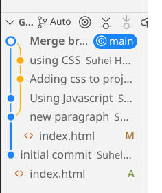

# Git Tutorial Overview

<!-- incremental_lists: true -->

- How to import projects into Git
- How to commit changes
- How to manage branches
- How to collaborate using Git

<!-- end_slide -->

# Getting Help in Git

```bash
$ man git-log
$ git help log
```

- `man` shows the manual page
- `git help` allows using any viewer (see `git-help[1]`)

<!-- end_slide -->

# Setting up Your Identity

<!-- pause -->

- Configures your Git username and email globally.
<!-- pause -->

```bash
$ git config --global user.name "Your Name"
$ git config --global user.email "you@yourdomain.example.com"
```

<!-- end_slide -->

# Importing a New Project

```bash
$ tar xzf project.tar.gz
$ cd project
$ git init
  Initialized empty Git repository in .git/
```

<!-- pause -->

- Project is now versioned under Git.

<!-- end_slide -->

# Making changes

Modify some files, then add their updated contents to the index:

```bash
$ git add file1 file2 file3
```

You can see what is about to be committed using git diff with the --cached option:

```bash
$ git diff --cached
```

Without --cached, git diff will show you any changes that you’ve made but not yet added to the index.

<!-- end_slide -->

# Status

You can also get a brief summary of the situation with git status:

```bash
$ git status
On branch main
Changes to be committed:
  (use "git restore --staged <file>..." to unstage)

	modified:   file1
	modified:   file2
	modified:   file3
```

<!-- end_slide -->

# Commit Changes

- Commit your changes with:

```bash
$ git commit
```

- Will again prompt you for a message describing the change, and then record a new version of the project.

- Alternatively, instead of running `git add` beforehand, you can use

```bash
$ git commit -a
```

<!-- end_slide -->

# Good Commit Messages

- Start with a short title (≤50 characters)
- Then a blank line
- Then a detailed description

Example:

```
Fix login bug
Fixed session timeout issue causing user logout.
Added refresh token support.
```

<!-- end_slide -->

# Git Tracks Content, Not Files

- `git add` stages **new and modified contents**.
- Git does not track "file renames" explicitly — only content.

<!-- pause -->

# Ignoring Files

- Use `.gitignore` to tell Git which files/folders to ignore.

```plaintext
# Example .gitignore
*.log
node_modules/
.env
```

<!-- end_slide -->

# Viewing Project History

```bash
$ git log
commit 89abcde...
Author: Your Name <you@example.com>
Date:   Thu Apr 29 12:00 2025

    Updated file1, file2, file3

commit 0123456...
Author: Your Name <you@example.com>
Date:   Thu Apr 29 11:00 2025

    Initial commit
```

<!-- end_slide -->

# Managing Branches

```bash
$ git branch experimental
$ git branch
* main
  experimental
$ git switch experimental
    Switched to branch 'experimental'
```

- Alternatively, use `git checkout -b` to create a new branch.

```bash
$ git checkout -b experimental
    Switched to a new branch 'experimental'
```

<!-- end_slide -->

# Merging Changes

- Merged development lines into main.

```bash
$ git checkout main
$ git merge experimental
    2 files changed, 2 insertions(+), 1 deletion(-)
```

<!-- end_slide -->

# Resolving Merge Conflicts

- Conflicts occur when two branches modify the same part of a file.
- Git will mark conflicts in the file.
- Manually edit the file to resolve conflicts.
- After fixing:

```bash
git add <file>
git commit
```

<!-- end_slide -->

# Deleting Branches

```bash
$ git branch -d experimental
    Deleted branch experimental (was 89abcde).
$ git branch -D crazy-idea
    Deleted branch crazy-idea (was deadbeef).
```

<!-- end_slide -->

# Using Git for Collaboration 1/2

<!-- incremental_lists: true -->

- Bob clones Alice's repository.

```bash
bob$ git clone 'url_to_alice_repo' myrepo
    Cloning into 'myrepo'...
    done.
```

- Bob makes changes.

```bash
bob$ git commit -a
    [main 89abcde] Bob's changes
```

<!-- end_slide -->

# Using Git for Collaboration 2/2

<!-- incremental_lists: true -->

- Bob pushes his changes to online repository.

```bash
bob$ git push origin main
```

- Alice pulls Bob's changes.

```bash
alice$ git pull 'url_to_bob_repo' main
```

<!-- end_slide -->

# Inspecting Remote Changes

```bash
$ git fetch https://github.com/bob/repo.git main
$ git log -p HEAD..FETCH_HEAD
```

- Review remote changes before merging.

# Defining Remote Shortcuts

```bash
$ git remote add bob https://github.com/bob/repo.git
$ git fetch bob
```

- Simplify repetitive fetches and pulls.

<!-- end_slide -->

# Pulling from Remote Branch

```bash
$ git pull . remotes/bob/main
```

- Merge remote-tracked changes into the local branch.
- pull = fetch + merge.

<!-- end_slide -->

# Exploring History

```bash
$ git show HEAD
    commit 89abcde...
```

```bash
$ git show HEAD^
    commit 0123456...
```

```bash
$ git show HEAD~4
```

- Traverse commit ancestry.

<!-- end_slide -->

# Tagging Commits

```bash
$ git tag v2.5 1b2e1d63ff
```

- Mark commits for releases and stable points.

# Diffing Commits

```bash
$ git diff v2.5 HEAD
$ git branch stable v2.5
```

- View differences and create stable branches.
- Start a new branch named "stable" based at v2.5

<!-- end_slide -->

# Resetting to Previous Commits

```bash
$ git reset --hard HEAD^
HEAD is now at 0123456 Initial commit
```

- **Warning**: Destroys history after HEAD^.

<!-- end_slide -->

# Searching Content

```bash
$ git grep "hello" v2.5
src/hello.c: printf("hello world!\n");
```

- Search for text across your repository.

<!-- end_slide -->

# Visualizing Git History

```bash
$ gitk
```

- Shows a full visual graph of branches, commits, merges.




<!-- end_slide -->

# Comparing Specific Files

```bash
$ git diff v2.5:Makefile HEAD:Makefile.in
```

```bash
$ git show v2.5:Makefile
```

- Compare different versions of individual files.

<!-- end_slide -->

# Distributed Git

<!-- incremental_lists: true -->

- Git is **Distributed**.
- You do a **"clone"** of the entire repository.
- Each user can has a **full backup** of the main repository.
- If the server crashes, any user’s copy can restore it.
- No **single point of failure**, unless only one copy exists.
- **Endless workflows** can be implemented.
- Flexibility and robustness are core features.

<!-- end_slide -->

# Subversion-Style Workflow

<!-- column_layout: [1, 1] -->
<!-- column: 0 -->

<!-- pause -->

Centralized workflow for Git:

<!-- incremental_lists: true -->

- All developers push to the same server.
- Git enforces synchronization: you can't push unless you've fetched new changes.

<!-- column: 1 -->


<!-- reset_layout -->

<!-- end_slide -->

# Integration Manager Workflow

Popular in **open-source** projects:


<!-- incremental_lists: true -->

- Developers clone the blessed repository.
- Push to their own repositories.
- Request the **Integrator** to pull changes.

<!-- end_slide -->

# Dictator and Lieutenants Workflow

Used for **large-scale projects** (e.g., Linux Kernel):


<!-- incremental_lists: true -->

- **Lieutenants** manage subsystems.
- **Dictator** pulls from lieutenants.
- **Blessed repository** is updated for everyone to clone.

<!-- end_slide -->

# Summary

<!-- incremental_lists: true -->

- Git tracks **content**, not files
- Branches and merges are cheap
- Collaboration is seamless
- Visualization tools (example: `gitk`) make Git easier to understand

<!-- end_slide -->

# References

- [](https://git-scm.com)
