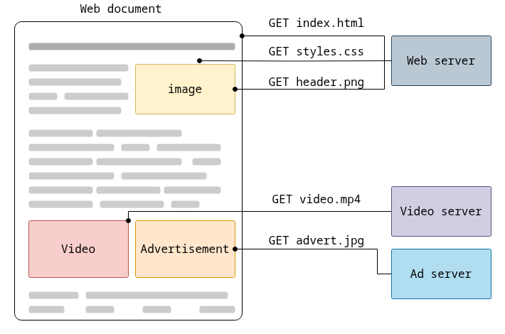

# What is HTTP?
<!-- incremental_lists: true -->

- **HTTP** stands for **Hypertext Transfer Protocol**  
- It is an **application-level protocol** used to exchange information between:
  - **Client:** typically a web browser or app
  - **Server:** hosts web content or APIs
- **Stateless:** Each request is independent and has no memory of previous interactions

**Example:**  
When you type `https://www.example.com`  
→ Browser sends an HTTP request  
→ Server responds with the requested page

<!-- end_slide -->

# The HTTP Request-Response Cycle
<!-- incremental_lists: true -->

1. **Client sends a request**
   - Method (GET, POST, etc.)
   - URL
   - Headers
   - Optional body

2. **Server processes the request**
   - Finds the resource
   - Generates a response

3. **Server sends a response**
   - Status line (e.g., 200 OK)
   - Headers
   - Body (HTML, JSON, etc.)

**This cycle happens for every HTTP interaction.**

<!-- end_slide -->

#  Fetching HTML documents
Document is typically constructed from resources such as text content, layout instructions, images, videos, scripts, and more.


<!-- end_slide -->

# HTTP Request Structure

## Example Request:
```
GET /index.html HTTP/1.1
Host: [www.example.com](http://www.example.com)
User-Agent: Mozilla/5.0
Accept: text/html
```
1. **Request line** → method, path, version  
2. **Headers** → metadata (browser type, content type, etc.)  
3. **Body (optional)** → data sent with POST/PUT
<!-- end_slide -->

# HTTP Response Structure

## Example Response:
```
HTTP/1.1 200 OK
Content-Type: text/html
Content-Length: 1234

<html>
  <body>Hello World!</body>
</html>
```

1. **Status line** → protocol, status code, message
2. **Headers** → metadata about the response
3. **Body** → the actual content (HTML, JSON, etc.)

<!-- end_slide -->

# Common HTTP Methods

<!-- incremental_lists: true -->

| Method     | Description           | Typical Use                    |
| ---------- | --------------------- | ------------------------------ |
| **GET**    | Retrieve data         | Loading a web page             |
| **POST**   | Send data to server   | Submitting a form              |
| **PUT**    | Update a resource     | Editing content                |
| **DELETE** | Remove a resource     | Deleting a record              |
| **HEAD**   | Like GET, but no body | Checking resource availability |

**Methods define what action the client wants to perform.**

<!-- end_slide -->

# HTTP Status Codes

| Code                          | Meaning           | Example                  |
| ----------------------------- | ----------------- | ------------------------ |
| **200 OK**                    | Request succeeded | Page loaded successfully |
| **301 Moved Permanently**     | Resource moved    | URL redirection          |
| **404 Not Found**             | Resource missing  | Page not found           |
| **500 Internal Server Error** | Server problem    | Code issue on server     |

**Status codes** help clients understand what happened with the request.

<!-- end_slide -->

# Request Headers Examples

| Header            | Purpose                | Example                       |
| ----------------- | ---------------------- | ----------------------------- |
| **Host**          | Domain of the server   | `Host: example.com`           |
| **User-Agent**    | Browser info           | `User-Agent: Chrome/120`      |
| **Accept**        | Content types accepted | `Accept: text/html`           |
| **Authorization** | Credentials            | `Authorization: Bearer token` |

**Headers** provide context and control how the server handles the request.

<!-- end_slide -->

# Response Headers Examples

| Header            | Purpose              | Example                     |
| ----------------- | -------------------- | --------------------------- |
| **Content-Type**  | Data type returned   | `Content-Type: text/html`   |
| **Set-Cookie**    | Store session data   | `Set-Cookie: sessionID=123` |
| **Cache-Control** | Caching behavior     | `Cache-Control: no-cache`   |
| **Location**      | Redirect destination | `Location: /login`          |

These headers help browsers manage content and behavior.

<!-- end_slide -->

# Cookies and Sessions

<!-- incremental_lists: true -->

* **Cookies** are small data pieces stored in the browser
* Used to remember:

  * Login sessions
  * Preferences
  * Shopping carts

Since HTTP is **stateless**, cookies help maintain **state** across multiple requests.

<!-- end_slide -->

<!-- incremental_lists: true -->


# HTTP Versions

* **HTTP/1.0 (1996)** → simple, one request per connection
* **HTTP/1.1 (1999)** → persistent connections, caching
* **HTTP/2 (2015)** → multiplexing, compression, binary format
* **HTTP/3 (2022)** → based on QUIC, faster and more secure

HTTP evolves to improve **speed**, **security**, and **efficiency**.

<!-- end_slide -->

# HTTPS: Secure HTTP

<!-- incremental_lists: true -->

* **HTTPS = HTTP + TLS (encryption layer)**
* Ensures:

  * **Confidentiality** – data is encrypted
  * **Integrity** – data not modified in transit
  * **Authentication** – verifies server identity
* Uses **port 443** instead of **port 80**

**Example:**
`https://www.example.com` → Encrypted, secure connection

<!-- end_slide -->

# RESTful APIs and HTTP

<!-- incremental_lists: true -->

* **REST (Representational State Transfer)** uses HTTP for APIs
* Operations mapped to HTTP methods:

  * `GET /users` → Retrieve users
  * `POST /users` → Add user
  * `PUT /users/1` → Update user
  * `DELETE /users/1` → Remove user

HTTP is the foundation of modern **web APIs**.

<!-- end_slide -->

# Summary

<!-- incremental_lists: true -->

* HTTP defines how web clients and servers communicate
* Uses **requests** and **responses** with defined structure
* Supports multiple **methods** and **status codes**
* **HTTPS** adds security
* Widely used for **web apps** and **REST APIs**

**HTTP = The language of the Web**

<!-- end_slide -->

# References:

* [MDN Web Docs: HTTP Overview](https://developer.mozilla.org/en-US/docs/Web/HTTP/Overview)
* [HTTP Status Codes](https://developer.mozilla.org/en-US/docs/Web/HTTP/Status)
* [HTTP Methods](https://developer.mozilla.org/en-US/docs/Web/HTTP/Methods)
